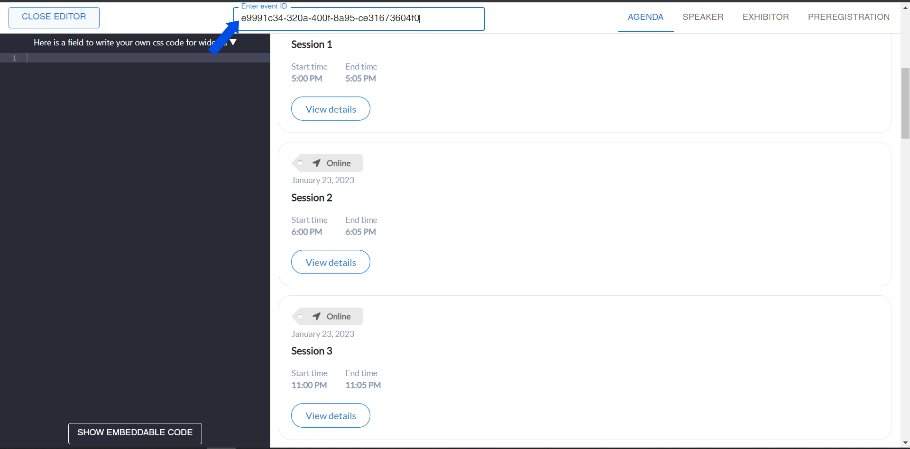
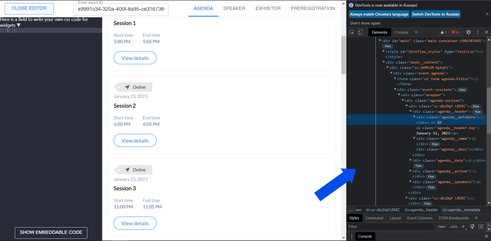
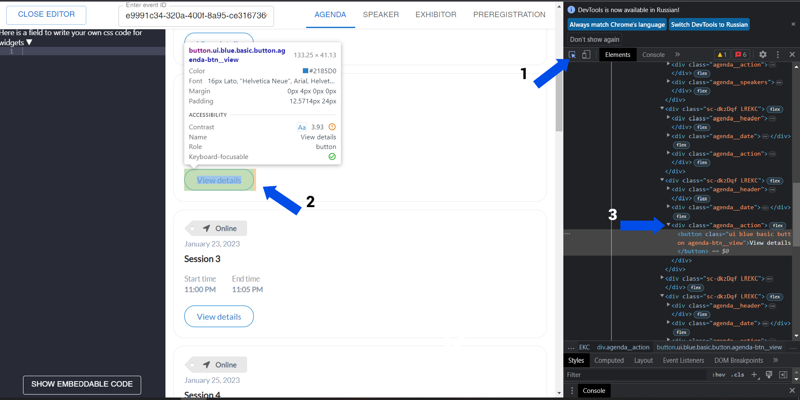
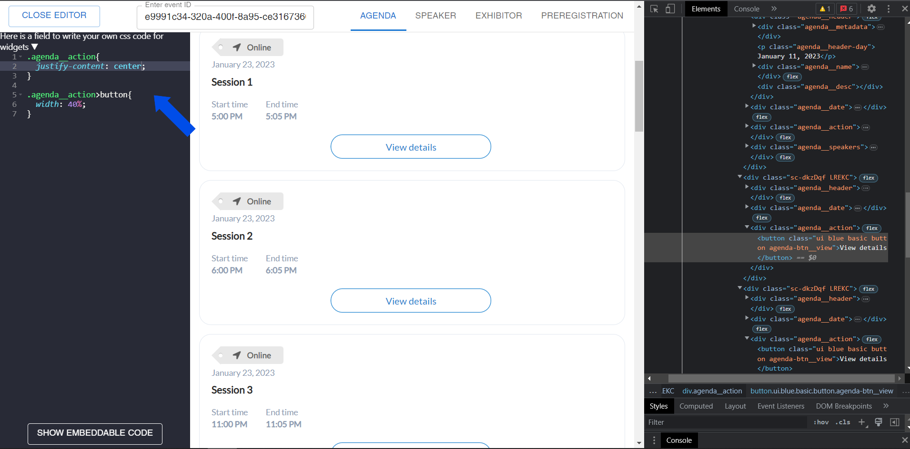
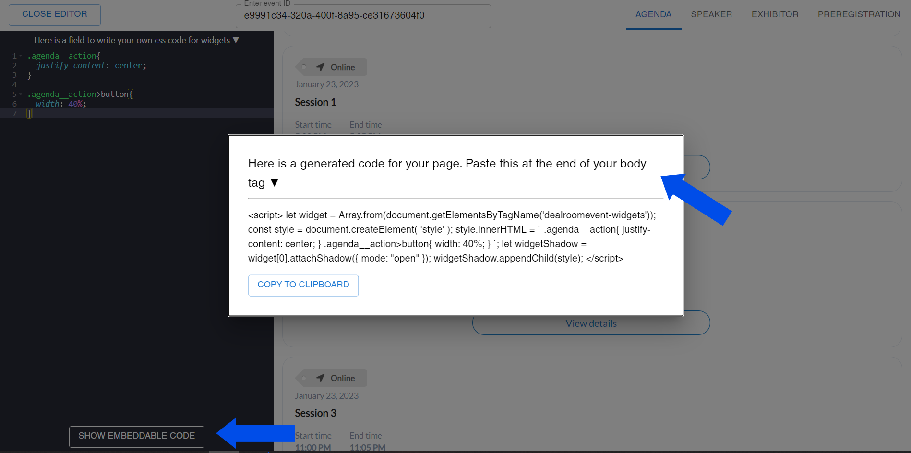

# Dealroom-widgets sandbox

Welcome to the dealroom-widgets sandbox

## How to get started ?

## Note

As you may have noticed, this is a sandbox page where you can view different widgets with your custom styles, which you can later insert into your page.
